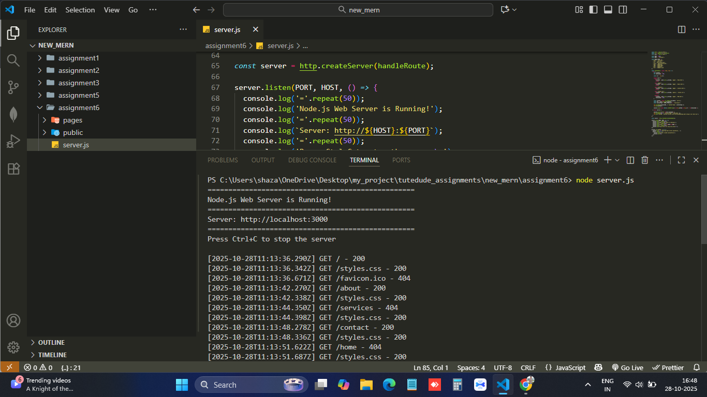
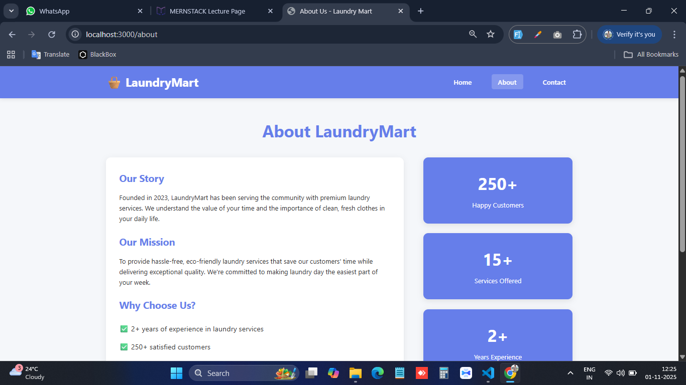
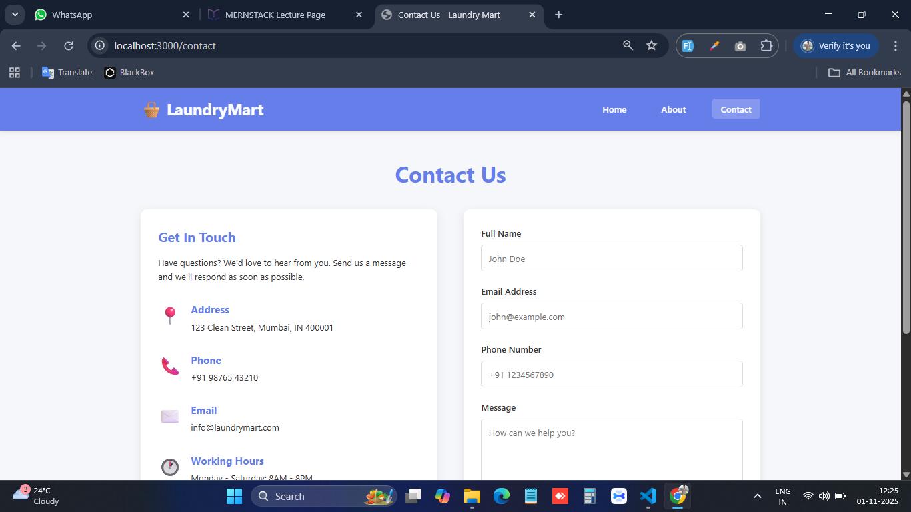
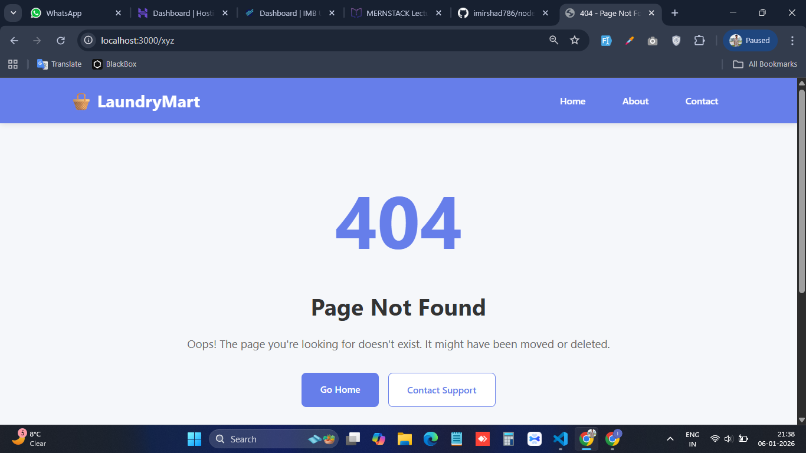

# 🧺 LaundryMart - Node.js Web Server

A professional web server built with Node.js HTTP module, featuring a complete laundry service website with multiple routes, custom error handling, and modern responsive design.


## 👨‍💻 Author

**Arshad**
- GitHub: [@arshad](https://github.com/imirshad786)
- Assignment: Node.js Custom Web Server

---


## 🎯 About The Project

This is a custom web server built from scratch using Node.js's built-in `http` module (no frameworks like Express). The server handles multiple routes, serves HTML pages with CSS styling, implements proper error handling, and features a complete laundry service website.

**Assignment Objective:** Create a simple web server with Node.js that handles different routes and serves corresponding HTML pages with proper HTTP status codes and error handling.

---

## 🛠️ Tech Stack

- **Runtime:** Node.js (v14.0.0 or higher)
- **Core Modules:**
  - `http` - Web server creation
  - `fs/promises` - Asynchronous file operations
  - `path` - File path handling
- **Frontend:**
  - HTML5
  - CSS3 (with Flexbox & Grid)
  - Vanilla JavaScript

---

## 📁 Project Structure

```
nodejs-web-server/
│
├── server.js              # Main server file
│
├── pages/                 # HTML pages directory
│   ├── home.html         # Home page
│   ├── about.html        # About page
│   ├── contact.html      # Contact page
│   └── 404.html          # 404 Error page
│
├── public/               # Static assets directory
│   └── styles.css        # Main stylesheet
│
├── package.json          # Project metadata
└── README.md            # Project documentation
```

---


### Running the Server

1. **Start the server**

```bash
node server.js
```

2. **Expected Output**

```
==================================================
🚀 Node.js Web Server is Running!
==================================================
📍 Server: http://localhost:3000
🏠 Home: http://localhost:3000
ℹ️  About: http://localhost:3000/about
📞 Contact: http://localhost:3000/contact
==================================================
Press Ctrl+C to stop the server
```
---

### Server Logs

The server logs all incoming requests:

```
[2025-01-15T10:30:45.123Z] GET  - 200
[2025-01-15T10:30:50.456Z] GET /about - 200
[2025-01-15T10:31:00.789Z] GET /invalid-route - 404
```

---

## 🛣️ Routes

### Available Routes

#### 1. **Home Page** (`/` or ``)
- Landing page with hero section
- Service features
- Call-to-action buttons
- **Status Code:** 200

#### 2. **About Page** (`/about`)
- Company story and mission
- Statistics and achievements
- Team information
- **Status Code:** 200

#### 3. **Contact Page** (`/contact`)
- Contact form
- Address and contact details
- Working hours
- Social media links
- **Status Code:** 200

#### 5. **404 Error Page** (Any invalid route)
- Custom error message
- Navigation options
- **Status Code:** 404

#### 6. **CSS Route** (`/styles.css`)
- Serves main stylesheet
- **Status Code:** 200

---

## 📸 Screenshots

### Server Running on port 3000


### Home Page


### About Page


### Contact Page


### 404 Page


---

## ✅ Assignment Requirements

This project fulfills all the assignment requirements:

### Basic Requirements
- [x] Create Node.js project with main file (server.js)
- [x] Use HTTP module to create server
- [x] Implement routing for different HTML pages
- [x] Create at least three HTML pages
- [x] Server listens on port 3000
- [x] Routes for , /about, /contact
- [x] Appropriate HTTP status codes (200, 404, 500)
- [x] Error handling with custom 404 page

### Enhanced Requirements
- [x] CSS styling on all pages
- [x] Additional routes (Services page)
- [x] Meaningful content (Complete laundry website)


---


## 📝 License

This project is created for educational purposes as part of a Node.js assignment.

Distributed under the MIT License. See `LICENSE` file for more information.

---

## 📧 Contact

**Arshad**

- GitHub: [@arshad](https://github.com/imirshad786)
- Email: irshadofficial5@gmail.com
- LinkedIn: [Your LinkedIn](https://linkedin.com/in/md-irshad-ansari)

**Project Link:** [https://github.com/arshad/nodejs-web-server](https://github.com/imirshad786/nodejs-webserver)


---

<div align="center">

### ⭐ If you found this project helpful, please give it a star!

Made with ❤️ by **Arshad**

</div>